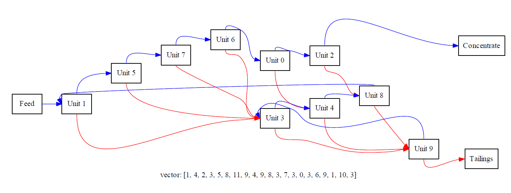

# Optimal Production Circuit by Genetic Algorithms
by Richard Boyne, Hameed Khandahari, Ye Liu, Yuxuan Liu, Gareth Lomax, Wade Song, Yujie Zhou

This project involved writing a C++ implementation of a Genetic Algorithm optimiser to solve an optimisation problem with an extremely high number of possible configurations. This implementation was able to find the optimal configuration (seen below) and do so in an efficient manner with code parallelised for HPC viable deployment. The full development was just one week, requiring careful concurrent working between three groups formed around the key elements of this project, each working on their own Github branch. Travis integrated testing was used throughout this project.

# About The Problem
For the refinement of mined minerals individual units which separate waste (tailings) and desired product (concentrate) with a given efficiency have to be configured in a circuit for optimal product quantity vs quality (given by a relevant cost function). For the given cost function a 10 unit circuit has the following optimal configuration:

# Repository Structure

- HPC/ holds the config files (i.e. run settings) used along with their runtimes and figures
- meeting_minutes/ holds details of the meetings and the initial code structure plan
- results/ga_convergence/ holds figures and numerical results of the population during the optimisation
- includes/ holds all C++ .h header files
- src/ holds all C++ source code
- tests/ holds all tests used by travis.ci, these tests are run by calling run_tests.py which is done in the travis.yml file
- tools/ the basic skeleton provided with this project including the visualisation python script and an example make file
- 'Optimization using Genetic Algorithms_Report.pdf' and 'Genetic_Algorithm_Theory.pdf' describe the problem, implementation, theory and results in depth.

# User Manual

## Setup
 - All source files can be found in the src folder. The src/config.csv file contains the parameters of genetic algorithm circuit solver. Remember to set up the config.csv first.  
 - The includes folder contains all header files need to be included.
 - The tools folder contains the plotting tools we used to analyze the performance. 

## Run
- Under Linux, run all the makefile first to generate executable objects.
Then run the executable targets with the config.csv set before to gain the default output file.     
- Under Windows, choose an IDE such as Visual Studio to run our codes.
- for HPC computation the make file needs to be called with the relevant MPI make command
 
# License
This project is licensed under the MIT License - see the LICENSE.md file for details
